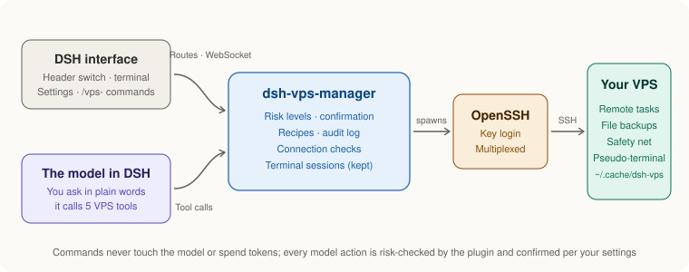

<div align="center">

# dsh-vps-manager

**Use your VPS inside DeepSeek Harness as seamlessly as over SSH: curated zero-token commands, plus the AI in the conversation can operate the server.**

**在 DSH 中和 SSH 一样无感地使用 VPS，除了精选的部分常用命令之外，使用时还能让对话中的大模型对 VPS 进行操作。**

<p>
  <a href="LICENSE"></a>
  <a href="https://www.npmjs.com/package/dsh-vps-manager"></a>
  
  
  
  
  <a href="https://github.com/AIcivilization/dsh-vps-manager/actions/workflows/dsh-compat.yml"></a>
  
</p>
<p>
  <a href="https://awesome-dsh-plugin.com/p/AIcivilization/dsh-vps-manager/"></a>
  <a href="https://dshget.com/plugins/AIcivilization/dsh-vps-manager"></a>
</p>

**English** · [简体中文](README.zh-CN.md)

</div>

---

## Overview

**Install**: search for `dsh-vps-manager` in the DSH plugin market and click install, or run the line below in the DSH terminal; then restart DSH and add a machine under **Settings → VPS Manager**.

```bash
dsh plugin add dsh-vps-manager
```

Manage your VPS from DeepSeek Harness (DSH): check server status with commands that skip the model and cost no tokens, tell the AI what to do and let it work on the server, open a real terminal in the conversation when you want to do it yourself, and handle common installs and maintenance with recipes.

Everything goes over SSH key login and shares one execution mechanism: operations that change things run as remote tasks and keep going if the connection drops; changes on the same machine run one at a time; config files are backed up before they are edited; an automatic restore is set up on the server before firewall or SSH changes; and every run is written to an audit log.

> **Want DSH itself running on your VPS?** See the sister project [deepseek-harness-vps](https://github.com/AIcivilization/deepseek-harness-vps): one command on the VPS installs stock DSH behind a login page with automatic HTTPS, reachable from any browser, with settings, API keys and the plugin market all working, and new DSH releases upgraded with one click in the page. The two work together: install this plugin in the DSH on your VPS and manage that server right from the conversation.

---

## At a glance

| Capability | What it does |
| --- | --- |
| Zero-token commands | 21 `/vps-` commands: check status, install software, reboot and wait for the machine to come back, without touching the model |
| VPS mode | One click in the conversation header and that conversation operates the server; each conversation has its own binding, so one window can work on the server while another keeps working on local code |
| Real connection state | Header squares: grey not selected · yellow connecting · green connected · red unreachable, with the reason and a retry button |
| Terminal in the conversation | A real terminal (xterm.js over `ssh -tt`) where menu scripts, `top` and `vim` work; red / yellow / green buttons to end, minimize and maximize; nothing lost when you minimize or switch conversations, and it reconnects after a drop |
| Files in the conversation | A file browser for the server: drag in to upload, right-click to download, double-click to edit, deletes go to a trash you can restore from; backups before overwriting or editing; right-click "let the AI look at this file" |
| AI on the server | 5 tools with risk-tiered confirmation: read-only runs automatically, changes ask you, dangerous commands ask again; levels can be set per machine, group or globally |
| Three safeguards | Files are backed up before editing and restored if validation fails; a connectivity safety net before firewall and SSH changes; long operations run as remote tasks that survive disconnects |
| Commands that fit the system | A health check finds the OS, package manager, init system, privilege, running services and containers, and the model is told to write commands for that machine |
| Recipe library | 29 repeatable recipes (7 install · 6 configure · 16 query); anything the AI gets working can be saved as a recipe in one sentence |
| Settings page | Add-machine wizard (key generation, public key placement), import from `~/.ssh/config`, baseline configuration, terminal settings, uninstall |
| Both kinds of DSH | DSH Desktop and `dsh web`; terminal connections pass DSH's sign-in check, a same-origin check and the plugin token, and open only on the local computer by default |
| Light install | No native modules (no node-pty to compile); the only runtime dependencies are `ws` and `yaml` |

---

## Screenshots

<!-- The plugin market picks images from the README as showcase pictures: real images only, no placeholders. Still screenshots go in assets/screenshots/. -->

<p align="center"></p>

<p align="center"><sub>From installing the plugin to reaching the first machine (the address and user name in the recording are blacked out)</sub></p>

---

## Contents

- [Three ways to use it](#three-ways-to-use-it) · [Requirements](#requirements) · [Install](#install) · [Adding a machine](#adding-a-machine)
- [Choosing a machine in a conversation](#choosing-a-machine-in-a-conversation) · [Terminal in the conversation](#terminal-in-the-conversation) · [Files in the conversation](#files-in-the-conversation) · [Commands](#commands) · [Talking to the AI](#talking-to-the-ai)
- [Recipes](#recipes) · [Settings page](#settings-page) · [How it works](#how-it-works) · [What it does not protect against](#what-it-does-not-protect-against)
- [Where data lives](#where-data-lives) · [Feedback and suggestions](#feedback-and-suggestions) · [Repository layout](#repository-layout) · [Development](#development)

---

## Three ways to use it

| | Look things up | Talk to the AI | Install and maintain with recipes |
|---|---|---|---|
| How | Commands like `/vps-sysinfo` | "Install nginx on this machine and reverse-proxy a.com to port 3000" | `/vps-install <recipe id>` shows the plan, `/vps-yes` runs it |
| Uses the model | No | Yes | No |
| Cost | Zero tokens | Normal token use | Zero tokens |
| Scope | Fixed read-only queries | Anything SSH can do, with confirmations by risk level | 29 recipes that are safe to run again |

---

## Requirements

- DeepSeek Harness 0.1.5-rc.2 (tested on DSH Desktop 2.0.10)
- macOS or Linux. The plugin relies on OpenSSH connection sharing, which the OpenSSH bundled with Windows does not support
- Node.js >= 22.13
- **SSH key login only.** Password login is not supported, and neither is `sudo` that asks for a password
- Operations that change the system need the remote user to be `root` or to have passwordless `sudo`; read-only queries do not

---

## Install

**Plugin market**: search for `dsh-vps-manager` in DSH's plugin market (dshmarket) and click install. Works in both DSH Desktop and `dsh web`.

**Command line**: in DSH Desktop, click the DSH icon in the menu bar (the system tray on Windows) → "Open DSH Terminal"; with command-line DSH (`dsh web`), use an ordinary terminal. Run:

```bash
dsh plugin add dsh-vps-manager
```

For the latest code on GitHub (possibly newer than the release on npm), use `github:AIcivilization/dsh-vps-manager` as the package name instead.

**Restart DSH** afterwards. Plugins are loaded when DSH starts.

To uninstall, open **DSH Settings → VPS Manager**, scroll to the bottom and click "Uninstall…" (see [Settings page](#settings-page)). You can also run `dsh plugin remove dsh-vps-manager` in a terminal and restart DSH; that removes only the plugin and keeps the machine list, keys, SSH configuration and audit log.

---

## Adding a machine

Open **DSH Settings → VPS Manager → "+ Add machine"**. It is one form:

- **Server**: IP or domain, SSH port, user, **password**
- **What to call it** (optional): alias (derived from the address if left empty), group, note

Click **Save and connect**:

1. The plugin generates a dedicated key `~/.ssh/dsh_vps_ed25519` (your existing keys are left alone)
2. It **logs in once with the password you entered** and adds that key's public half to `~/.ssh/authorized_keys` on the server (skipped if it is already there)
3. The connection settings go into `~/.ssh/config.d/dsh-vps.conf`, one `Include` line is added at the very top of `~/.ssh/config` (backed up first to `~/.ssh/config.dsh-bak`), and the machine is reached with the key and gets a health check
4. You see the result and the **host fingerprint** (recorded on first contact; if it ever changes the connection is refused, so nobody can pose as your server)

**The password is used once and never stored**: it goes only into the environment of that single `ssh` process and reaches `ssh` through `SSH_ASKPASS`. It is not written to any file, log or audit record, and every later connection uses the key. Adding with a password only works on the computer running DSH, so the password never crosses the network.

A wrong password, a server that refuses password logins, or a changed fingerprint is explained right in the form. For a **key-only server**, expand "No password?" under the form: paste the public key into your provider's "SSH keys" page, or run a one-line command on a server you can already log in to, then click "The public key is in place, connect".

Machines already defined in `~/.ssh/config` can be taken over with "Import from ~/.ssh/config". The plugin never rewrites what you wrote in `~/.ssh/config`.

---

## Choosing a machine in a conversation

The conversation header has a **VPS switch**: the word `VPS`, then the terminal button `>_`, then one small square per machine. Each square shows its number (1 for the first machine, 2 for the second, and so on), matching the numbers on the settings page.

- **A square's colour is the real connection state**, not just whether it is selected:
  - **Grey**: this conversation has not selected that machine
  - **Yellow (pulsing)**: selected, connecting
  - **Green**: selected, and just checked to be reachable
  - **Red**: selected, but unreachable. The reason is shown below the input box (for example "the SSH configuration has no entry for this machine") with a retry button; hovering the square shows it too

  A live check runs when you turn the switch on, open the conversation, or come back to the DSH window (tens of milliseconds over the shared connection). Every command, AI tool call and terminal connection also records whether it reached the server, and the square follows
- **Click a square**: this conversation enters **VPS mode**. From then on `/vps-` commands act on that machine, and the plugin tells the model which machine this conversation operates on, what system it runs (package manager, init system, privilege), which program holds ports 80/443, which services and containers are running, plus a few rules it must follow (never guess names, handle systemd services only through systemctl, never turn a failed lookup into a restart or reinstall). The model writes commands for that system, and knows what you mean by "this machine" or "the server"
- **In VPS mode the model cannot use local bash**: a call is refused with a pointer to the VPS tools, so the model does not investigate server problems on your own computer. Reading files, searching and similar tools are unaffected
- **Click it again**: VPS mode ends, the square turns grey, and local bash is available again. With nothing bound there is **no default machine at all**: commands do not run, and the AI must name the machine it operates on
- Each conversation can be bound to one machine at a time. **A binding only applies to its own conversation**: one window can operate the server in VPS mode while another keeps working on local code, without affecting each other
- The same from the keyboard: `/vps-use <alias>` binds, `/vps-use off` unbinds
- A machine that has never had a health check gets one in the background when the switch is turned on, so the model receives its system details

Nothing is shown below the input box, except a single line in three cases: a task is running on the machine, the machine is unreachable, or its disk is at least 85% full.

---

## Terminal in the conversation

The **`>_`** button right after `VPS` in the conversation header is the terminal. Once a machine is bound, click it and a real terminal opens below the input box, working just like an SSH session (with only one machine you can click it before binding, and it binds that machine for you):

- Menu scripts, `top`, `htop`, `vim`, `docker exec -it`, `mysql` and other programs that need keystrokes all work, as do Ctrl+C, arrow keys and CJK text
- Three round buttons at the top right of the terminal:
  - **Red ×**: end this terminal; the shell on the server and anything running in it end too
  - **Yellow −**: minimize to a bar below the input box ("terminal running in the background · open N minutes"); the terminal keeps running, and clicking the bar brings it back
  - **Green**: maximize; the terminal fills the conversation area and the input box moves to the top. Click again (or double-click the title bar) to restore
- The `>_` button in the header is still a switch: not open → open; open → minimize; minimized → restore. While minimized it shows a small green dot
- **Minimizing, switching to another conversation and coming back keeps the terminal and everything on it**
- **Reloading the page or losing the network**: the server keeps the terminal for a while (10 minutes by default, adjustable in settings). Come back within that time and it reconnects automatically, replaying the output you missed; only after that does it end
- At normal size, drag the bottom-right corner to change the height; full-screen programs redraw at the new size, and the height is remembered
- Turning the VPS switch off or moving to another machine ends that conversation's terminal
- What you type and see here **does not go to the AI**; run a command with `/vps-sh` when you want the AI to see its output
- Opening and ending are recorded in the audit log (keystrokes are not)

**Settings** (DSH Settings → VPS Manager → 终端 / Terminal): colour scheme (follow system / dark / light, where follow system matches DSH's appearance), font size (11–20), how long to keep the terminal after a disconnect (5 minutes / 10 minutes / 30 minutes / 1 hour), and whether other devices may open it.

**It works in both DSH Desktop and `dsh web`**: the connection follows the page address (an `https` page automatically uses an encrypted connection). Every connection must pass three checks: DSH's own sign-in check, an origin that is the DSH page itself, and the plugin token embedded in that page. On top of that, **by default the terminal only opens on the computer running DSH**: when you reach `dsh web` through a LAN address or a reverse proxy, first tick "允许从其他设备打开 VPS 终端" (allow opening the VPS terminal from other devices) under DSH Settings → VPS Manager → Terminal. The terminal is full control of the server, so only turn this on for access paths you trust.

No native module has to be compiled on your machine: the pseudo-terminal on the server is requested with `ssh -tt`, and window-size changes are applied over a second SSH connection. The terminal display is [xterm.js](https://xtermjs.org) (MIT licensed, bundled with the plugin and loaded the first time you open a terminal).

## Files in the conversation

The terminal panel's title bar has a **Terminal | Files** switch. Files is a file browser for the server this conversation is bound to:

- **Browse**: common places on the left (home, the website directory, `/etc`, `/var/log`, root, trash) and a clickable path on top; click the empty part of the path to type one (`~` means home). Columns sort, and files starting with `.` are hidden until you turn on "show hidden files"
- **Upload**: drag files in from your computer, or click Upload; there is a progress bar and you can cancel. Before overwriting, it asks, backs the original up to `~/.cache/dsh-vps/backups/` on the server, and **keeps its mode and owner**. New files get 644 and new folders 755, so web servers can read them. An upload that breaks off halfway leaves the original untouched
- **Download**: right-click, Download; a folder is packed into a `.tar.gz` as it downloads
- **Edit**: double-click a text file (up to 1 MB) to edit it, save with ⌘S / Ctrl+S, and the original is backed up first. If the AI or anyone else changed the file after you opened it, you are asked whether to reload or overwrite. Files that can lock you out when wrong (`sshd_config`, firewall rules) are flagged at the top
- **Delete**: moves to a trash on the server (`~/.cache/dsh-vps/trash`) you can restore from; deleting permanently or emptying the trash asks again. Top-level system directories (`/etc`, `/usr` and the like) cannot be deleted
- **Let the AI look at this file**: right-click it and the content, with secrets masked, is handed to the AI; just ask your question in the input box ("what's wrong with this config"). Large files such as logs send only the last 48 KB
- Also: new folder, rename, copy path, and "open this folder in the terminal" (switches back and `cd`s there)
- Every upload, download, edit, delete and restore is written to the audit log. Like the terminal, it opens only on the computer running DSH by default
- It works as the SSH login user without escalating, so places that user cannot change say "permission denied"

---

## Commands

Commands skip the model and cost no tokens. DSH folds a command's result down to one line, so the first line of every result is the conclusion.

**Two rules:**

1. Commands act on **the machine bound to the current conversation**. If nothing is bound, they do not run.
2. **Commands listed without arguments below must be sent as the bare command name.** DSH only passes the text after a command to the plugin when the command declares arguments. Add text after a command that takes none, and the whole line is sent to the model as an ordinary message. Anything that needs confirmation shows a plan first, and you confirm by sending `/vps-yes` on its own.

**Commands you type are shared with the AI**: DSH itself never passes command results to the model. The plugin keeps your last few `/vps-sh` commands and their output (tokens, passwords and private keys masked first) and attaches them the next time you talk to the AI, so you can investigate yourself and then just ask "why did that fail?". Prefix `--private` to keep a command out of it.

### Entry points

| Command | What it does |
|---|---|
| `/vps-help` | Every command and how to use it |
| `/vps-yes` | Confirms the plan you just saw: a reboot, an install, or a dangerous command that was held. Only for the current conversation, valid for 5 minutes, runs once |

### Looking things up

| Command | What it does |
|---|---|
| `/vps-sysinfo` | OS, CPU, memory, disk, load, public IP |
| `/vps-disk` | Mounts, inodes, largest directories (the scan has a time limit) |
| `/vps-ports` | Listening ports and the processes behind them |
| `/vps-services` | Running and failed services |
| `/vps-net` | Network interfaces, cumulative traffic, connection count |
| `/vps-docker` | Containers and disk usage |
| `/vps-ping` | Hostname, OS, load, uptime |
| `/vps-logs <service>` | The last 100 log lines of a service |
| `/vps-q <recipe id>` | Runs any query recipe, e.g. `ip-info`, `top-procs`, `cron-list`, `cert-expiry`, `firewall-status`, `updates`, `login-history` |
| `/vps-sh <command>` | Runs a command on the machine and shows the output in the conversation: the directory you `cd` into is remembered within the conversation; commands that keep refreshing or page (`top`, `tail -f`, `journalctl -f`, `less`, `watch`) are turned into one-shot output, and things that cannot work here (`vim`, interactive shells) point you to the [terminal](#terminal-in-the-conversation); commands judged dangerous are held until you send `/vps-yes`. Prefix `--bg` to run in the background, `--private` to keep this output away from the AI |

### Machines

| Command | What it does |
|---|---|
| `/vps-list` | Registered machines and their status; ★ marks the one bound to the current conversation |
| `/vps-use <alias>` | Binds the current conversation to a machine; `/vps-use off` removes the binding |
| `/vps-probe` | Runs the health check again: OS, init system, package manager, privilege, CPU, memory, disk |
| `/vps-reboot` | Checks before rebooting: why a reboot is needed (kernel or libc updates waiting), whether now is a safe time (it refuses while the package manager is installing or a plugin task is running), which containers will stop, and whether they will start again by themselves. `/vps-yes` reboots, waits for the machine to come back, and reports the kernel change, containers and failed services. If the machine is still unreachable after 5 minutes, it tells you to check your provider's console |

### Installs and tasks

| Command | What it does |
|---|---|
| `/vps-recipes` | The recipe list, grouped into installs, configuration and queries |
| `/vps-install <recipe id> [key=value …]` | Shows the plan: detection result, parameters and their defaults, steps, and the script itself. `/vps-yes` runs it |
| `/vps-tasks` | Remote tasks on the machine |
| `/vps-task <task id> [--stop]` | A task's state and log; add `--stop` to terminate it |

### Troubleshooting

| Command | What it does |
|---|---|
| `/vps-doctor` | Plugin and DSH versions (and whether this DSH version is verified), registration status of each part, the machine bound to the current conversation, a connectivity test, recent errors and runs; ends with a pre-filled feedback link |

---

## Talking to the AI

The plugin registers 5 tools for the model, plus a set of operating rules (the `vps-operator` skill, which the model reads when it needs to):

| Tool | What it does |
|---|---|
| `vps_hosts` | Lists registered machines |
| `vps_exec` | Runs a script on a machine |
| `vps_write_file` | Writes a remote file: backs it up first and restores it if validation fails |
| `vps_task` | Remote tasks: list, status, log, terminate |
| `vps_recipe` | Recipes: list, show, run, and save what was just done as a recipe |

### Confirmation by risk level

Before any script runs, the plugin decides its risk level. **The level the model declares can only raise the result, never lower it.**

| Level | Examples |
|---|---|
| **Read-only** | `df -h`, `systemctl status`, `docker ps`, `journalctl` |
| **Change** | `apt-get install`, `sed -i`, `systemctl restart`, writing files |
| **Dangerous** | `rm -rf`, `mkfs`, firewall changes (`ufw`, `iptables`), `passwd`, `reboot`, killing processes (`kill`, `pkill`, `killall`), `curl … \| sh` |

Whether a confirmation dialog appears depends on the machine's confirmation level (machine > group > global):

| Level | Read-only | Change | Dangerous |
|---|---|---|---|
| **Careful** (default) | Automatic | Ask | Ask |
| **Relaxed** | Automatic | Automatic | Ask |
| **Fully automatic** | Automatic | Automatic | Automatic |
| No approval UI available | Automatic | **Refused** | **Refused** |

### Three safeguards

- **Files are backed up before edits.** `vps_write_file` copies the original to `~/.cache/dsh-vps/backups/` on the server, writes atomically (an existing file keeps its mode and owner), runs the validation command you give it (such as `nginx -t`), and restores the original if validation fails
- **Connectivity safety net.** Before firewall, SSH or network changes, a timed restore is set up on the server (120 seconds by default). After the change, a brand-new connection is used to test access. If it cannot connect, the restore runs when the time is up, so you are not locked out
- **Long operations survive disconnects.** Operations that change things run as remote tasks that continue on the server if the connection drops, and you can check on them again later. Cancelling only stops waiting and does not kill the task; terminating a task is always an explicit action

---

## Recipes

29 built-in recipes, each safe to run again:

- **Installs (7)**: Docker, Nginx, fail2ban, common CLI tools, Portainer, Uptime Kuma, Nginx Proxy Manager
- **Configuration (6)**: system update, system cleanup, swap, timezone, BBR congestion control, automatic security updates
- **Queries (16)**: system info, disk, ports, services, network, containers, service logs, reachability and load, health check, public IP, top processes, scheduled tasks, certificate expiry, firewall status, available updates, login history

Install and configuration recipes have four parts:
- **detect**: checks whether it is already installed or already in the target state
- **plan**: the steps, written for people
- **run**: does the work
- **verify**: proves it actually works, e.g. `docker info` rather than `docker --version`

A recipe that is already in its target state skips the install and goes straight to verification.

Pass parameters as `key=value`. The plan lists every parameter with its default:

```text
/vps-install setup-swap size_mb=4096
/vps-yes
```

### Adding your own

- **Ask the AI to save one.** After it has done something reusable for you, say "save this as a recipe". It turns the specific values into parameters and adds `detect` and `verify`; the plugin checks that no password or key slipped in, then saves it as `$DSH_HOME/vps-manager/recipes/my-<id>.yml`
- **Write a YAML file yourself** and put it in that directory

Your own recipes get a `my-` id prefix and cannot replace built-in ones. To change one, save it again under the same id; to delete one, delete its file.

Your own recipes are treated as untrusted: their risk level is the stricter of what the recipe declares and what the plugin's static analysis finds, and the first run after a recipe is added or changed asks for confirmation at least at the "change" level.

---

## Settings page

**DSH Settings → VPS Manager**, all point-and-click, never through the model:

- **Machine list**: number (matching the squares in the conversation header), address, privilege, group, note; one-click connectivity test
- **Add machine**, and **Import from ~/.ssh/config**
- **Per-machine settings**: alias, address, port, user, jump host, public key placement, host fingerprint, confirmation level, removal
- **Basics**: fill in the state you want (timezone, swap size, BBR, automatic security updates, fail2ban, common CLI tools). On save, only the items that differ from the current state are run, each as a remote task with progress shown
- **Global settings**: default confirmation level, safety-net duration, and whether changes may be made from the settings page when DSH's web server is open to the local network
- **Terminal**: colour scheme (follow system / dark / light), font size, how long to keep the terminal after a disconnect, and whether the [terminal](#terminal-in-the-conversation) may be opened from other devices (off by default)
- **Feedback and diagnostics**: plugin and DSH versions, registration status of each part, recent errors (masked); "report a problem" and "suggest" open a pre-filled GitHub issue
- **Data location**
- **Uninstall**: tick what to do, confirm, and see the result of each step. On DSH Desktop the plugin can be removed directly, followed by a one-click DSH restart; elsewhere you get the terminal command to run
  - Remove the plugin itself (ticked by default)
  - Remove the SSH connection settings (ticked by default): the `Include` line the plugin added at the top of `~/.ssh/config` is removed and `config.d/dsh-vps.conf` is renamed as a backup, so both can be restored
  - Clean up the plugin directory `~/.cache/dsh-vps` on the servers (machines with a running task are skipped)
  - Revoke the plugin key's login access on the servers (its line is removed from `authorized_keys`, after a backup). If that key is your only way into a server, you will be locked out
  - Delete the plugin's dedicated key, and delete the plugin data (machine list, audit log, your own recipes); these cannot be restored

  Server-side items run first, because once the local configuration and key are gone the servers can no longer be reached. Only the first two items are ticked by default

The settings page's backend only accepts same-origin JSON requests carrying a token generated at random each time DSH starts. **It offers no arbitrary command execution and cannot write arbitrary files.** When DSH's web server is bound to `0.0.0.0`, operations that change a server are turned off by default.

---

## How it works

<p align="center">
  
</p>

- **One engine, three entry points**: the settings page, `/vps-` commands and the AI tools share one execution engine. Scripts reach the server on SSH's standard input and are written to a file before they run, so no outside data is ever spliced into the remote command line
- **Shared connections**: each machine uses one SSH master connection (OpenSSH ControlMaster), so commands and connection checks over it take tens of milliseconds
- **Remote tasks**: operations that change things run as tasks under `~/.cache/dsh-vps/` on the server, with a lock, and keep going after a disconnect; you can reattach and read the log at any time
- **Terminal**: the pseudo-terminal is requested on the server with `ssh -tt`, and the browser reaches the plugin over a WebSocket; if the connection drops, the session is kept for a while and the missed output is replayed on reconnect
- **What the model is told**: when a conversation enters VPS mode, the plugin gives the model that machine's system, services, containers and the rules it must follow; in VPS mode the model cannot use local bash

---

## What it does not protect against

- **Risk-level confirmation guards against AI mistakes, not against an AI set on getting around it.** Static analysis cannot recognise every disguised form, and the model can also use DSH's own bash tool to ssh into the server directly
- **DSH's sandbox does not cover the ssh processes this plugin starts itself**
- **Nothing typed in the terminal goes through risk-level confirmation.** You are typing the commands yourself, exactly as in SSH, and the plugin does not intercept them
- **There is no general rollback.** What you have is file backups, the connectivity safety net and recipes that can be run again. Take a snapshot in your provider's console before reinstalling the OS, upgrading to a new major release, or repartitioning

---

## Where data lives

| Location | Contents |
|---|---|
| `$DSH_HOME/vps-manager/hosts.yml` | Machines, groups, confirmation levels (safe to edit by hand) |
| `$DSH_HOME/vps-manager/state.json` | Health check results and which machine each conversation is bound to |
| `$DSH_HOME/vps-manager/recipes/` | Your own recipes |
| `$DSH_HOME/vps-manager/audit/` | Audit log: one JSON line per run (source, machine, action, level, result), one file per month, kept for 6 months |
| `~/.ssh/config.d/dsh-vps.conf` | SSH connection settings maintained by the plugin |
| `~/.ssh/dsh_vps_ed25519` | The dedicated key the plugin generates |
| `~/.cache/dsh-vps/` on the server | Remote task directories, logs, file backups |

The plugin never reads private key contents, and passwords never pass through it.

---

## Feedback and suggestions

- **Something wrong**: send `/vps-doctor` in DSH, or click **Settings → VPS Manager → 反馈问题** (report a problem). It opens a GitHub issue pre-filled with the plugin version, DSH version and diagnostics for you to review and edit before submitting. Diagnostics are masked and contain no machine addresses; **the plugin never uploads anything by itself**
- **Suggestions**: [open a suggestion](https://github.com/AIcivilization/dsh-vps-manager/issues/new?template=feature_request.yml)
- **Broke after a DSH upgrade**: every 6 hours the plugin is tested against DSH's latest, next and alpha releases (install the plugin, boot the web app, check each part), and a failing run opens an issue automatically; see [compatibility issues](https://github.com/AIcivilization/dsh-vps-manager/issues?q=label%3Adsh-compat). When the DSH version you run has not been verified, the settings page and `/vps-doctor` say so

Errors the plugin runs into itself (registration failures, backend errors, interface errors) are kept locally under `$DSH_HOME/vps-manager/logs/`, masked, for 3 months.

---

## Repository layout

| File | Purpose |
| --- | --- |
| `lib/index.js` | Plugin entry: registers tools, commands, the skill, VPS mode, settings routes and the terminal |
| `lib/commands.js` | The 21 `/vps-` commands |
| `lib/tools.js` | The 5 tools for the model |
| `lib/risk.js` · `lib/safety.js` | Risk classification, tiered confirmation, connectivity safety net |
| `lib/engine.js` · `lib/payload.js` · `lib/prelude.sh` | Execution engine: payloads, remote tasks, the cross-distro prelude |
| `lib/actions.js` · `lib/task.js` · `lib/files.js` | Health checks, runs, remote tasks, file edits (backup + validation + restore) |
| `lib/recipes.js` · `lib/recipe-store.js` · `recipes/` | Loading, running and saving recipes; the 29 built-in recipes |
| `lib/vps-mode.js` · `lib/skills/vps-operator.md` | VPS mode and the operating rules for the model |
| `lib/terminal-server.js` · `lib/vendor/xterm/` | The in-conversation terminal (server side) and the bundled xterm.js |
| `lib/terminal.js` | The `/vps-sh` mini terminal: remembered directory, interactive-command rewriting, masking |
| `lib/reach.js` | Connection checks (the colour of the header squares) |
| `lib/health.js` · `lib/verified-dsh.json` | Self-diagnostics: registration results, DSH version verification, local error log, feedback link |
| `scripts/compat-smoke.mjs` · `.github/workflows/dsh-compat.yml` | Compatibility check: install the plugin, boot a real DSH web app and check each part, against DSH's three release channels every 6 hours |
| `lib/client.js` | Interface: header switch, terminal panel, notices below the input box, settings page |
| `lib/routes.js` | Settings page backend |
| `lib/config.js` · `lib/onboarding.js` · `lib/ssh.js` | Machine list, SSH configuration, add-machine wizard, ssh arguments |
| `lib/reboot.js` · `lib/uninstall.js` · `lib/audit.js` | Reboot and wait for the machine, uninstall, audit log |
| `test/` | 238 tests |

---

## Development

```bash
npm install
npm test
```

238 tests, no real server needed: a local `sh -s` stands in for the remote `sshd`, covering the payload protocol, remote tasks, locking, backup and restore, risk classification, VPS mode, uninstall, commands, the settings-page backend, the terminal connection (authentication, local-only access, input and output, window size, keeping and resuming after a disconnect, cleanup) and UI rendering. On a machine with DSH Desktop installed, tool definitions, return values, skill fields and approval outcomes are also checked against DSH's own `dsh-tools`, `dsh-skill` and `dsh-user-approval`, along with whether the notice the plugin adds to a conversation is accepted by the host's session format.

---

## License

[MIT](LICENSE)

Bundled third-party code: `lib/vendor/xterm/` contains [xterm.js](https://github.com/xtermjs/xterm.js) 6.0.0 and addon-fit 0.11.0, MIT licensed, copyright the xterm.js authors; see [lib/vendor/xterm/LICENSE](lib/vendor/xterm/LICENSE).
